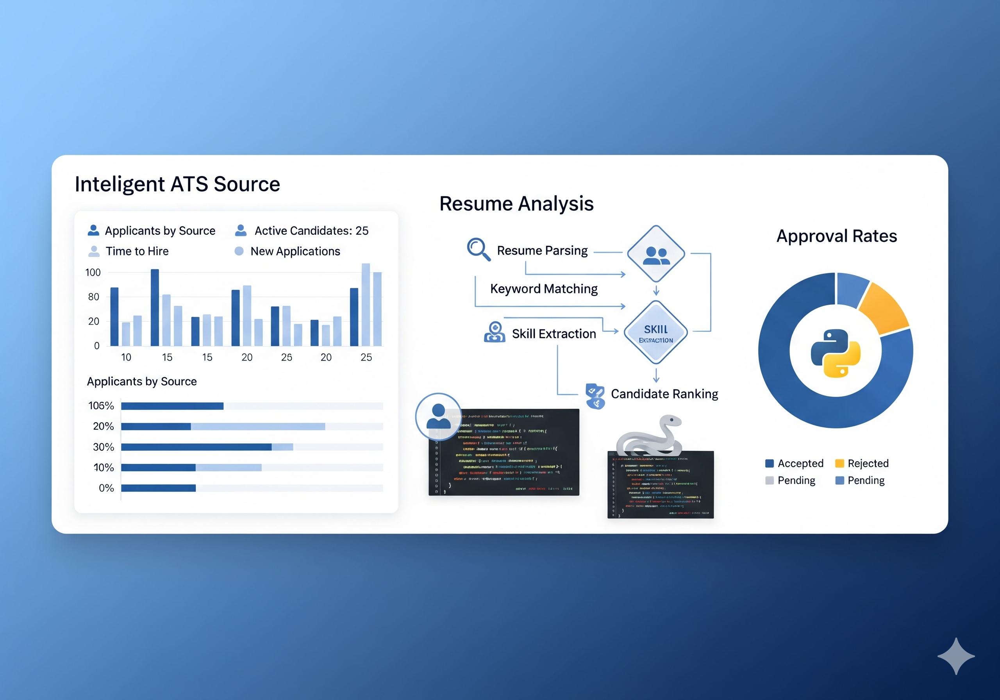

# Sending_CV - Sistema de Análise ATS

[](https://opensource.org/licenses/MIT)
[](https://www.python.org/downloads/)



Sistema para análise de currículos usando tecnologia ATS (Applicant Tracking System) e envio automatizado de emails para empresas.

## Funcionalidades

- **Análise ATS**: Pontuação automática baseada em palavras-chave
- **Suporte Multi-formato**: PDF, DOCX e TXT
- **Envio Automatizado**: Emails personalizados com currículo anexado
- **Dashboard Web**: Interface Streamlit para monitoramento
- **Sistema Organizado**: Estrutura por vaga para eficiência
- **Controle de Horários**: Funcionamento apenas em horário comercial
- **Logging Completo**: Acompanhamento em Excel
- **Follow-up Automático**: Controle de acompanhamentos

## Instalação

### Pré-requisitos
- Python 3.8+
- Conta Gmail com verificação em 2 etapas
- Git

### Passos

1. **Clone o repositório**
```bash
git clone https://github.com/chmulato/Sending_CV.git
cd Sending_CV
```

2. **Crie ambiente virtual**
```bash
python -m venv venv
venv\Scripts\activate  # Windows
```

3. **Instale dependências**
```bash
pip install -r requirements.txt
```

4. **Configure Gmail**
   - Ative verificação em 2 etapas
   - Gere senha de app
   - Configure em `config.yaml`

## Configuração

### config.yaml
```yaml
email:
  usuario: "seu_email@gmail.com"
  senha_app: "sua_senha_de_app"
  servidor_smtp: "smtp.gmail.com"
  porta: 587

envio:
  delay_entre_emails: 30
  max_envios_por_dia: 10
  horario_funcionamento:
    inicio: "09:00"
    fim: "17:00"
```

### empresas.xlsx
```
| Empresa   | Vaga                 | Email          | Localização |
|-----------|----------------------|----------------|-------------|
| Empresa A | Desenvolvedor Python | rh@empresa.com | São Paulo   |
```

## Uso

### Modos de Execução

#### Análise Básica
```bash
python main.py analise
```

#### Sistema Organizado por Vaga
```bash
python main.py organizado
```

#### Análise + Envio Automático
```bash
python main.py envio
```

#### Dashboard Web
```bash
streamlit run core/dashboard.py
```

### Utilitários

#### Criar Vaga Organizada
```bash
python core/criar_vaga_organizada.py "Vaga" "Empresa" "Cidade"
```

#### Testes
```bash
python test/test_complete.py
```
Teste abrangente que valida:
- Estrutura do projeto e arquivos essenciais
- Configurações e dados
- Conversão de documentos (PDF, DOCX)
- Dependências Python
- Módulos principais
- **Conectividade de email (SMTP)**
- **Simulação de envio de emails**
- Execução do sistema principal

## Estrutura do Projeto

```
Sending_CV/
├── core/                # Scripts principais
├── curriculos/          # Currículos
├── vagas/               # Vagas organizadas
├── log/                 # Logs e resultados
├── templates/           # Templates de email
├── test/                # Scripts de teste
├── config.yaml          # Configurações
├── empresas.xlsx        # Lista de empresas
├── main.py              # Script principal
└── requirements.txt     # Dependências
```

## Como Funciona

### Processo ATS
1. **Extração**: Converte PDF/DOCX para texto
2. **Pré-processamento**: Remove stopwords e caracteres especiais
3. **Análise**: Conta frequência de palavras-chave
4. **Pontuação**: Calcula compatibilidade (0-100%)
5. **Filtro**: Aprovados ≥70%

### Critérios
- **Aprovado**: ≥70% de compatibilidade
- **Reprovado**: <70% de compatibilidade

## Tecnologias

- **Python 3.8+**: Linguagem principal
- **pandas**: Manipulação de dados
- **Streamlit**: Interface web
- **yagmail**: Envio de emails
- **pdfplumber**: Extração PDF
- **python-docx**: Processamento DOCX

## Troubleshooting

### Problemas Comuns

**Erro de autenticação Gmail**
- Verifique verificação em 2 etapas
- Gere nova senha de app
- Aguarde 5-10 minutos

**Erro de conectividade SMTP**
- Execute `python test/test_complete.py` para testar conexão
- Verifique configurações em config.yaml
- Confirme que senha de app está correta
- Teste conexão com servidor SMTP

**Erro na conversão PDF**
- Verifique se PDF não é imagem
- Execute `python test/test_complete.py` para diagnóstico completo

**Dependências não encontradas**
- Execute `pip install -r requirements.txt`
- Verifique versão Python

## Contribuição

1. Fork o projeto
2. Crie branch: `git checkout -b feature/nova-feature`
3. Commit: `git commit -m 'Adiciona nova feature'`
4. Push: `git push origin feature/nova-feature`
5. Abra Pull Request

## Histórico dos Artigos e Melhorias

### Artigos Publicados

#### 1. "Como Automatizar sua Busca por Emprego com Python"
- **Data de Publicação**: 16 de julho de 2025
- **Arquivo**: `docs/ARTIGO_SENDING_CV.md`
- **Tema**: História do projeto, automação da busca por emprego
- **Foco**: Case study prático, resultados obtidos, impacto pessoal
- **Status**: Publicado

#### 2. "Áreas Quentes do Currículo e o Poder da Tecnologia ATS"
- **Data de Publicação**: 02 de setembro de 2025
- **Arquivo**: `docs/ARTIGO_ATS.md`
- **Tema**: Análise técnica ATS, evolução do sistema
- **Foco**: Áreas quentes do currículo, tecnologia ATS, arquitetura do sistema
- **Status**: Preparado para publicação

### Sistema Upgraded - Melhorias Implementadas

#### Funcionalidades Adicionadas
- Testes Abrangentes: Sistema de testes completo com 56 testes (92.9% sucesso)
- Simulação de Email: Teste específico para `chmulato@hotmail.com`
- Correção SSL/TLS: Configurações adequadas para Gmail SMTP
- Organização de Testes: Script único `test_complete.py` substituindo múltiplos arquivos
- Documentação Técnica: Hash codes e referências para publicação

#### Arquivos de Documentação
- `docs/ARTIGO_SENDING_CV.md` - Artigo sobre automação da busca por emprego
- `docs/ARTIGO_ATS.md` - Artigo sobre tecnologia ATS e evolução do sistema
- `docs/ARTIGO_SENDING_CV.docx` - Versão DOCX do primeiro artigo
- `docs/ARTIGO_ATS.docx` - Versão DOCX do segundo artigo

#### Melhorias Técnicas
- Correção de Caminhos: Ajuste dos caminhos das imagens para compatibilidade DOCX
- Configuração SSL: `smtp_ssl=False` e `smtp_starttls=True` para Gmail
- Testes Automatizados: Cobertura completa do sistema (estrutura, configurações, emails)
- Documentação Git: Commit hash e informações técnicas para reprodutibilidade

#### Status Atual do Sistema
- **Versão**: v2.0
- **Testes**: 56 testes automatizados
- **Taxa de Sucesso**: 92.9%
- **Branch**: main
- **Último Commit**: `b30b791c78a2d8dbc647825278bff8ed1ffd48a9`

### Comparativo de Artigos

| Aspecto | Artigo 1 (Julho 2025) | Artigo 2 (Setembro 2025) |
|---------|----------------------|-------------------------|
| **Foco** | História prática | Análise técnica |
| **Público** | Candidatos a emprego | Profissionais de RH/Tech |
| **Tamanho** | Case study | Guia técnico completo |
| **Imagens** | 2 capturas de tela | 1 diagrama do sistema |
| **Referências** | GitHub básico | Hash codes completos |

### Próximos Passos
- Publicação do Artigo 2 em 02/09/2025
- Atualização contínua da documentação
- Expansão dos testes automatizados
- Feedback da comunidade para melhorias

---

## Licença

MIT License - veja [LICENSE](LICENSE) para detalhes.

## Suporte

- **Issues**: [GitHub Issues](https://github.com/chmulato/Sending_CV/issues)
- **Documentação**: Pasta `docs/`
