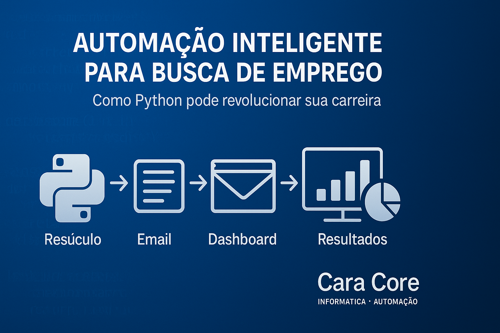
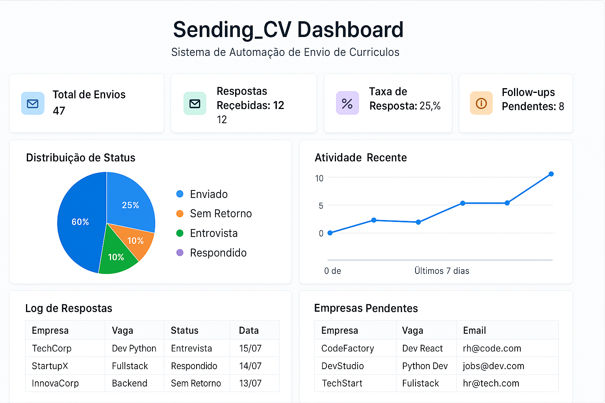

# Como Automatizar sua Busca por Emprego com Python

## Por Cara Core Informática - Automação Python

*Campo Largo, PR, 16 de julho de 2025*



**Figura 1:** Dashboard interativo do Sending_CV - Transformando a busca por emprego com automação inteligente e métricas em tempo real

Quantas vezes você perdeu horas enviando currículos manualmente? **E se pudesse automatizar todo esse processo?**

---

## A História por Trás do Projeto

Em 2024, João, um desenvolvedor Python com 4 anos de experiência, estava em transição de carreira. Após meses enviando currículos manualmente - abrindo planilhas, copiando emails, personalizando mensagens uma por uma - ele percebeu que estava gastando mais tempo com tarefas repetitivas do que se preparando para entrevistas.

"Tem algo errado aqui", pensou ele depois de passar 3 horas enviando apenas 8 currículos. "Sou programador e estou fazendo trabalho manual que um script poderia resolver em minutos."

Foi então que nasceu o **Sending_CV** - não apenas uma ferramenta, mas uma solução real para um problema que milhares de profissionais enfrentam diariamente.

---

## O Problema

A busca por emprego envolve tarefas repetitivas que consomem tempo precioso:

- Envio manual de currículos para múltiplas empresas
- Controle disperso do que foi enviado
- Follow-ups esquecidos por falta de organização

**A solução?** Usar Python para resolver nosso próprio problema!

---

## O Projeto Sending_CV

Sistema completo que automatiza o processo de candidatura a vagas:

**Funcionalidades Principais:**

- **Envio automatizado** com personalização por empresa
- **Dashboard interativo** com métricas em tempo real
- **Sistema de follow-up** inteligente
- **Controle de segurança** com rate limiting

**Stack Tecnológico:**

```python
- pandas & yagmail    # Dados e emails
- streamlit & plotly  # Dashboard
- schedule & PyYAML   # Automação
```

---

## O Resultado da Primeira Execução

João ainda se lembra do momento em que rodou o script pela primeira vez:

```bash
python main.py
```

Em 15 minutos, o sistema havia:

- Enviado 25 currículos personalizados
- Registrado todas as interações no log
- Agendado follow-ups automáticos
- Gerado relatórios no dashboard

"Isso que eu fazia em dois dias, o script fez em 15 minutos", relatou João. Três semanas depois, ele recebeu 7 respostas positivas e conseguiu 3 entrevistas - **o triplo da taxa de resposta anterior**.

Mas o mais importante: ele tinha tempo para se preparar adequadamente para cada entrevista, estudar as empresas e aprimorar suas habilidades técnicas.

---

## Resultados Práticos

**Eficiência comprovada:**

- **95% menos tempo** em tarefas repetitivas
- **10x mais candidaturas** por dia
- **3x maior taxa de resposta** com follow-ups

**Antes vs Depois:**

```plaintext
Antes: 2 horas para 5 currículos
Depois: 5 minutos para 50 envios
```

---

## Como Funciona

**Arquitetura simples:**

```plaintext
empresas.xlsx → personalização → envio → dashboard → follow-up
```

**Configuração básica:**

```yaml
envio:
  max_envios_por_dia: 10
  horario_comercial: "9h-17h"
followup:
  dias_para_seguimento: 7
```

---

## Por que Automatizar?

**Demonstra competências técnicas:**

- Identificação e solução de problemas reais
- Aplicação prática de programação
- Pensamento em automação e eficiência

**Aplicação empresarial:** Na Cara Core Informática, usamos conceitos similares para email marketing, prospecção B2B e automação de processos.

---

## O Impacto Além da Tecnologia

A verdadeira transformação não foi apenas técnica. João percebeu que havia desenvolvido uma **mentalidade de automação** - começou a identificar outros processos ineficientes em sua rotina e carreira.

"Quando você resolve um problema real com código, não é apenas sobre a tecnologia", reflete João. "É sobre **pensar diferente, ser estratégico e focar no que realmente importa**."

Hoje, João trabalha como Tech Lead em uma startup e ainda usa uma versão evoluída do Sending_CV para mapear oportunidades e manter networking ativo no mercado.

A lição? **A tecnologia deve trabalhar para nós, não o contrário.**

---

## Conclusão

A tecnologia deve trabalhar para nós, não o contrário.

**Projeto open source no GitHub:** [https://github.com/chmulato/Sending_CV](https://github.com/chmulato/Sending_CV)

Contribuições são bem-vindas!



---

- **Cara Core Informática - Automação**

Quer implementar uma solução similar na sua empresa?
Precisa automatizar algum processo repetitivo?

**Entre em contato conosco!**

**Repositório do projeto:** [https://github.com/chmulato/Sending_CV](https://github.com/chmulato/Sending_CV)

---

### Tags

`#Python` `#Automação` `#CarreiraTech` `#BuscaPorEmprego` `#OpenSource` `#CaraCore`

---

*Gostou? Compartilhe com outros profissionais que podem se beneficiar desta automação!*
